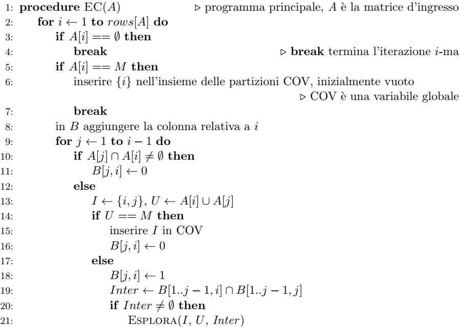
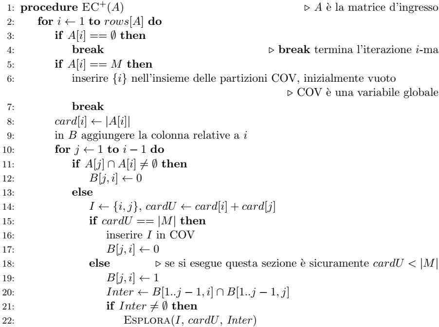
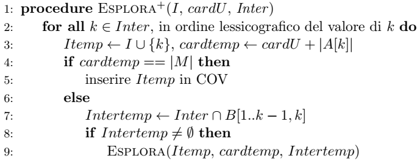

# Progetto di Algoritmi e Strutture Dati AA 2021/2022

- [Progetto di Algoritmi e Strutture Dati AA 2021/2022](#progetto-di-algoritmi-e-strutture-dati-aa-20212022)
  - [Introduzione](#introduzione)
  - [Consegna del progetto](#consegna-del-progetto)
  - [Implementazione](#implementazione)
    - [Input e Output](#input-e-output)
  - [Autori](#autori)

## Introduzione

Questa relazione descrive lo sviluppo e le scelte implementative da noi fatte
per il progetto di Algoritmi e Strutture Dati relativo all'Anno Accademico 2021/2022.

Il progetto è realizzato interamente in Python (versione >= 3), sfruttando
in particolare le strutture dati fornite dalla libreria Numpy.

Tutto il codice sorgente è disponibile su [GitHub](https://github.com/LucaCtt/ASD_Cotti_Miorada).

## Consegna del progetto

Per comodità è qui riportata (brevemente) la consegna del progetto.

Il problema da risolvere è quello dell'Exact Cover,
che ha come input una collezione finita N di insiemi finiti (distinti) dove gli elementi di ogni insieme
appartengono al dominio M (si assume che M sia l’unione di tutti gli insiemi della collezione N),
e come output tutte le partizioni (o coperture esatte)
di M dove ciascuna parte è un insieme della collezione N.

Una partizione di M (vincolata da N) è un (sotto)insieme della collezione N costituito da
insiemi tutti reciprocamente disgiunti e tali che la loro unione è M.

Un primo algoritmo risolutivo del problema è EC, il cui pseudocodice è riportato di seguito:

EC ha come input una matrice A che rappresenta la collezione N,
e come output la matrice di compatibilità del problema.

Viene poi richiesto di sviluppare una versione migliorata dell'algoritmo, chiamata EC+.
Questa nuova versione migliora l'efficienza dell'algoritmo base memorizzando la cardinalità di ciascun insieme
della collezione al fine di evitare, durante l’intera esecuzione, il computo dell’unione di insiemi.

## Implementazione

### Input e Output

## Autori

Luca Cotti, Stefano Miorada